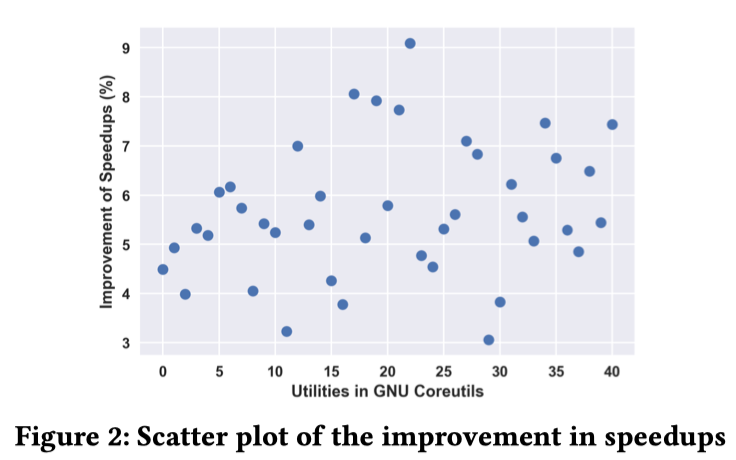

# Homepage of FastKLEE

**FastKLEE** is a tool that aims to speed up symbolic execution via reducing redundant bound checking of type-safe pointers. Two key insights behind **FastKLEE** are:
* The number of interpreted instructions tends to be stupendous (usually several billion only in one hour’s run)
* Only a small portion of pointers need bound checking during execution and reducing the interpreting overhead of most frequently interpreted ones (i.e., load/store instruction) could accelerate symbolic execution.

In terms of implementation, **FastKLEE** combines the notable type inference system [Ccured](https://people.eecs.berkeley.edu/~necula/Papers/ccured_popl02.pdf) and the well-known symbolic execution [KLEE](https://github.com/klee/klee) to perform faster symbolic execution.

Please kindly check out our [video demonstration](https://youtu.be/fjV_a3kt-mo) of **FastKLEE**.


## Installation

The tool **FastKLEE** has been tested on Ubuntu 18.04 and hasn’t been tested on other platforms up to now, so Ubuntu 18.04 is preferred.


To install FastKLEE, users could execute 

```
git clone https://github.com/haoxintu/FastKLEE
cd FastKLEE
./setup.sh
```

to set up both Ccured type inference system and the **FastKLEE** symbolic execution engine.

After installing the tool, copy the instrument file `neschecklib.bc` and the ccured analysis library `libccured.so` to the testing folder (`examples/fastklee-test` in this demo) and follow the following steps to perform testing.

## 1. Compile source code to the intermediate representation (IR)

For a single test program (e.g., `test.c`), users can get IR by executing

```
$clang -emit-llvm -c test.c -o test.bc
```

For more complex test programs (e.g., GNU Coreutils used in the paper), we recommend users to follow the [official document](http://klee.github.io/tutorials/testing-coreutils/) from KLEE to get their IR code file.

Up to now, we assume users have obtained the test program and compiled it into IR code already. We take the `cat` test program in GNU Coreutils as an example to illustrate the core usabilities of **FastKLEE**.

## 2. Instrument IR for preparing type inference
 
Use the compiler tool-chain `llvm-link` to link the target program `cat.bc` and the instrumentation code `neschecklib.bc` together.

```
$cat run-instrumentation.sh
llvm-link cat.bc neschecklib.bc -o cat-linked.bc
$./run-instrumentation.sh
```
## 3. Type inference and produce CheckList

Use the compiler tool-chain `opt` to load `libccured.so` library and perform type inference analysis. This process will produce a text file `cat-checklist.txt` that records all *unsafe* pointers in `cat.bc`. Such a checking list file will be used in the following process.
 
```
$cat run-type-inference-system.sh
opt -load libccured.so -nescheck -stats -time-passes < cat-linked.bc >& /dev/null
$./run-type-inference-system.sh
```


## 4. Conduct faster symbolic execution

Now, users can run **FastKLEE** to perform faster symbolic execution. Users could also change the options (e.g., timeout) to set up different experiments for their own purpose.

```
$cat run-fastklee.sh
fastklee --simplify-sym-indices --write-cvcs --write-cov --output-module \
--max-memory=1000 --disable-inlining --optimize --use-forked-solver \
--use-cex-cache --libc=uclibc --posix-runtime \
--external-calls=all --only-output-states-covering-new \
--env-file=test.env --run-in-dir=/tmp/sandbox \
--max-sym-array-size=4096 --max-solver-time=30s --max-time=1min \
--watchdog --max-memory-inhibit=false --max-static-fork-pct=1 \
--max-static-solve-pct=1 --max-static-cpfork-pct=1 --switch-type=internal \
--use-batching-search --batch-instructions=10000 \
--search=dfs \
--output-dir="output-fastklee-cat" \
./cat.bc --sym-args 0 1 10 --sym-args 0 2 2 --sym-files 1 8 --sym-stdin 8 --sym-stdout
$./run-fastklee.sh
```

**Note that the scripts used in this demo can be easily combined to be one to perform automated testing, we separate them when going through the demo only for the sake of the clear demonstration.**


## Evaluation Results

Evaluation results demonstrate that **FastKLEE** is able to reduce by up to 9.1% (5.6% on average) as the state-of-the-art approach KLEE in terms of the time to explore the same number (i.e., 10k) of execution paths.




## Acknowledgement

The authors would like to thank all the developers who contribute to this tool and anonymous reviewers for their insightful comments.
